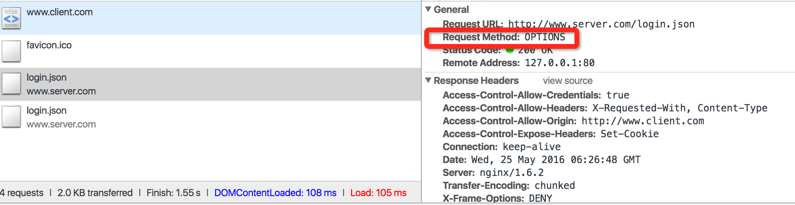
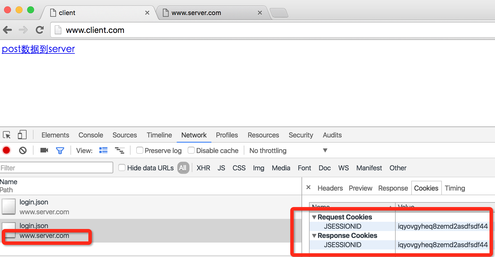

#跨域一般解决方法
[参考链接](http://www.ruanyifeng.com/blog/2016/04/cors.html) 阮一峰老师    
1.什么是同源策略？  
2.需要跨域时，有什么解决方法？  
3.总结。
##1.同源策略
同源策略指

```javascript
1.协议相同
2.域名相同
3.端口相同
```  
举个例子，网址：http://www.example.com, 其中协议http,域名www.example.com, 端口默认80(默认端口可省略)。 
 
```javascript
https://www.example.com(不同源，协议不同)；
http://a.example.com(不同源，域名不同);
http://www.example.com:8088(不同源，端口不同)；
```

如果在 网站http://www.example.com 向 http://www.example.com:8088 发起请求，那么浏览器会禁止请求。  
为什么会这样？试想一下，如果没有同源限制，会发生什么事？
假设我登录了a.com网站，然后又在浏览器访问了b.com网站，如果b.com能毫无限制的读取a.com网站的(cookie)信息，那么就a.com的隐私信息就会被盗取，例如sessionid,  用户资料。  

##2.跨域解决方法  
CORS是w3c的一个标准，他允许浏览器向跨源服务器发出ajax请求，但是CORS需要服务器浏览器同时支持，IE不低于10。  
浏览器CORS请求分为简单请求和非简单请求。
###2.1.简单请求
```javascript
(1) 请求方法是以下三种方法之一：
HEAD
GET
POST
(2）HTTP的头信息不超出以下几种字段：
Accept
Accept-Language
Content-Language
Last-Event-ID
Content-Type：只限于三个值application/x-www-form-urlencoded、multipart/form-data、text/plain
``` 
不满足以上条件就是非简单请求。  
###2.2.非简单请求
其他场景请参考[这里](http://www.ruanyifeng.com/blog/2016/04/cors.html)。下面测试验证一下：  
假设服务器域名为 http://www.server.com  
浏览器域名为 http://www.client.com

####模拟server服务器  

```javascript
var http = require('http');

http.createServer(function (req, res) {
	console.log(req.url);
	console.log(req.headers.cookie);
	 if (req.url == "/") {
		res.writeHead(200, { "Content-Type": "text/html" });
		res.end("Welcome to the homepage!");
	} else {
		res.setHeader('X-Frame-Options', 'DENY');
		res.setHeader('Access-Control-Expose-Headers', 'Set-Cookie');
		res.setHeader('Access-Control-Allow-Origin', 'http://www.client.com');
		res.setHeader('Access-Control-Allow-Headers', 'X-Requested-With, Content-Type');
		res.setHeader('Access-Control-Allow-Credentials', true);
		if(req.url == "/login.json") {
			res.setHeader('Set-Cookie', 'JSESSIONID=iqyovgyheq8zemd2asdfsdf44;Path=/;Domain=www.server.com');
		}
		res.writeHead(200);
		var json = JSON.stringify({code: 0});
		res.end(json);
	}
}).listen(8089, function() {
	console.log('server listen on 8089');
});
```
修改hosts文件  

```javascript
127.0.0.1	www.server.com www.client.com
```

nginx代理服务器

```javascript
upstream nodejs_http {
    ip_hash;
    server 127.0.0.1:8000;
}

server {
        listen       80;
        server_name  www.server.com;
        gzip         on;
        gzip_types   text/plain text/css application/json application/x-javascript text/xml application/xml text/javascript;

        location / {
            proxy_set_header  X-Real-IP  $remote_addr;
            proxy_set_header  X-Forwarded-For $proxy_add_x_forwarded_for;
            proxy_set_header  Host $http_host;
            proxy_redirect    off;

            proxy_pass https://nodejs_http;
        }
}
```
####模拟client浏览器

模拟client浏览器

```javascript
var http = require('http');
var fs = require('fs');
var htmlStr = fs.readFileSync('./client.html');
http.createServer(function (req, res) {
	res.writeHead(200, { "Content-Type": "text/html" });
	res.end(htmlStr.toString());
}).listen(8088,function (params) {
	console.log('client listen on 8088');
});
```

呃 随便一个html吧

```html
<!DOCTYPE html>
<html lang="en">
<head>
    <meta charset="UTF-8">
    <title>client</title>
</head>
<body>
    <a href="javascript:post()">post数据到server</a>
</body>
<script>
function post() {
    var data = {
        content: 'new content.'
    };
    var xhr = new XMLHttpRequest();
    xhr.withCredentials = true;
    xhr.onreadystatechange = function() {
        if (this.readyState === 4) {
            if(this.status === 200) {
                console.log(JSON.parse(this.responseText));
            }
        }
    }

    xhr.onerror = function(e) {
        console.error(e);
    }
    xhr.open('POST', 'http://www.server.com/login.json');
    xhr.setRequestHeader('Content-Type', 'application/json; charset=UTF-8');
    xhr.setRequestHeader('X-Requested-With', 'XMLHttpRequest');
    xhr.send(data);
}
</script>
</html>
```

好了，运行程序，在浏览器打开控制台，你会发现有两个login请求，第一个是请求的方法是OPTIONS, 这个是浏览器在CORS请求过程中向服务器发出的"预检"请求，符合要求才会执行真正的POST请求。  


如果要发送cookie，服务器还需要设置Access-Control-Allow-Credentials header, post中请求加入xhr.withCredentials = true;



注意 res.setHeader('Set-Cookie','JSESSIONID=iqyovgyheq8zemd2asdfsdf44;Path=/;Domain=www.server.com');
Domain要设置server的domain，如果不是https，不要加上Secure，否则浏览器不能设置cookie。

###总结

其实设置相应header就可以实现CORS访问了。

```javascript
res.setHeader('Access-Control-Expose-Headers', 'Set-Cookie');
//允许哪一个域名能访问。值可以设置为 '*', 表示都能访问，如果设置了'*', 请求又带有withCredentials(cookie),
//则浏览器不允许发送该请求。
res.setHeader('Access-Control-Allow-Origin', 'http://www.client.com');
res.setHeader('Access-Control-Allow-Headers', 'X-Requested-With, Content-Type');
//允许浏览器发送Cookie
res.setHeader('Access-Control-Allow-Credentials', true);
//如果需要设置cookies, 注意Domain, Secure不要设置错误
res.setHeader('Set-Cookie', 
'JSESSIONID=iqyovgyheq8zemd2asdfsdf44;Path=/;Domain=www.server.com[;Secure]');

//设置ajax
xhr.withCredentials = true;
```
