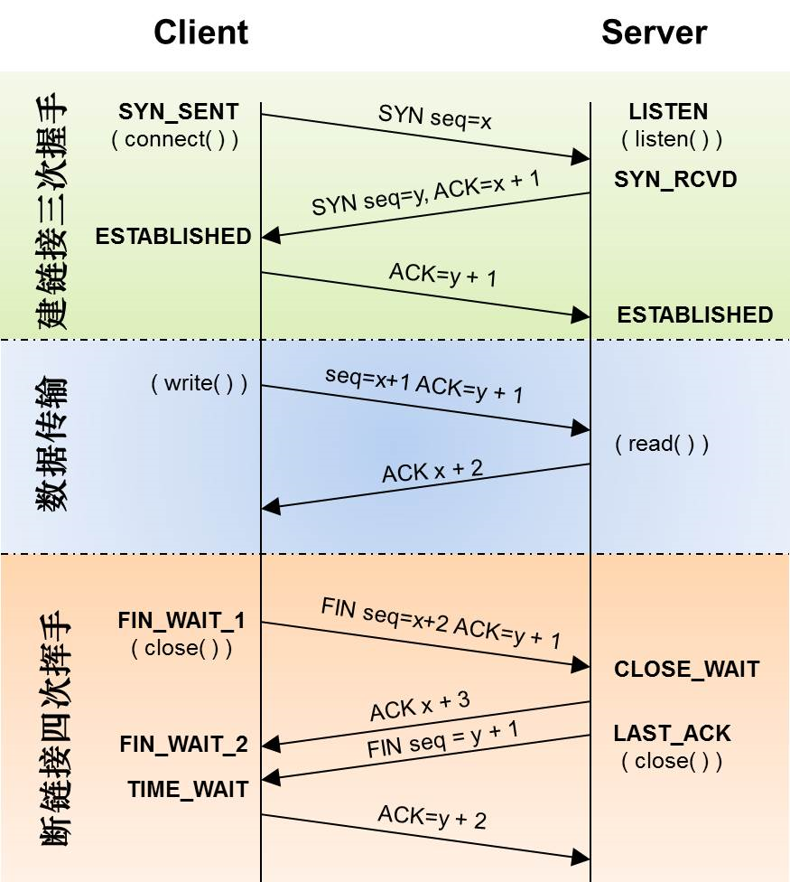

# HTTP2
HTTP2 是现行 HTTP1.x 的替代，它的状态码方法都与1.x一样，它是在底层通过二进制 frame 改进性能。

## HTTP1 问题
HTTP1.X 时代，一个 HTTP 只能处理一个请求，一般建立 TCP 连接时，都会再 headers 加 Connection: Keep-Alive 保持连接，默认情况下 TCP 链接建立后就不会断开，除非在请求 Headers 上加上 Connection: close，才会在请求完成后关闭连接（不会立即断开）。
由于 TCP 建立了持续连接，所以在后续请求中减少了建立连接的时间，虽然如此，多个请求时就会发生排队现象，比如第一个连接花了大部分时间处理请求，那么后面的请求需要等待。那么在 1.x 时代，怎么提高网页加载效率，同一连接处理多个请求，和服务器建立多个连接。  
服务器资源有限，浏览器也会限制连接数，不然服务资源就会浪费掉， Chrome 最多允许对同一域名建立 6 个 TCP 连接。

## HTTP2 
由于某些原因，浏览器可能会阻塞请求，DNS 查询， TCP 连接建立需要时间，这些问题都会导致我们网页加载速度变慢。  
HTTP2 解决方法
### 1. 新的二进制格式。
1.x的解析是基于文本，文本的表现形式有多样性，要做到健壮性考虑的场景必然很多，二进制则不同，只认0和1的组合。基于这种考虑http2.0的协议解析决定采用二进制格式，实现方便且健壮。
### 2. Header 压缩
http2.0使用encoder来减少需要传输的header大小，通讯双方各自cache一份header fields表，既避免了重复header的传输，又减小了需要传输的大小。高效的压缩算法可以很大的压缩header，减少发送包的数量从而降低延迟。
### 3. 流（stream）和多路复用（MultiPlexing）
stream就是在HTTP/2连接上的双向帧序列。每个http request都会新建自己的stream，response在同一个stream上返回。
多路复用（MultiPlexing），即连接共享。之所以可以复用，是因为每个stream高度独立，堵塞的stream不会影响其它stream的处理。一个连接上可以有多个stream，每个stream的frame可以随机的混杂在一起，接收方可以根据stream id将frame再归属到各自不同的request里面。

## 补充 TCP 建立过程图

